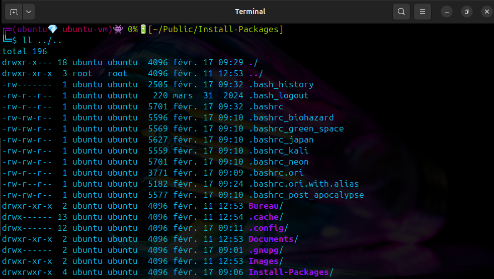
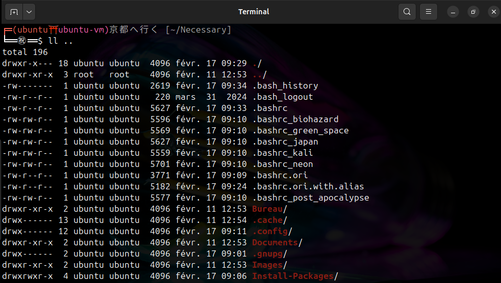
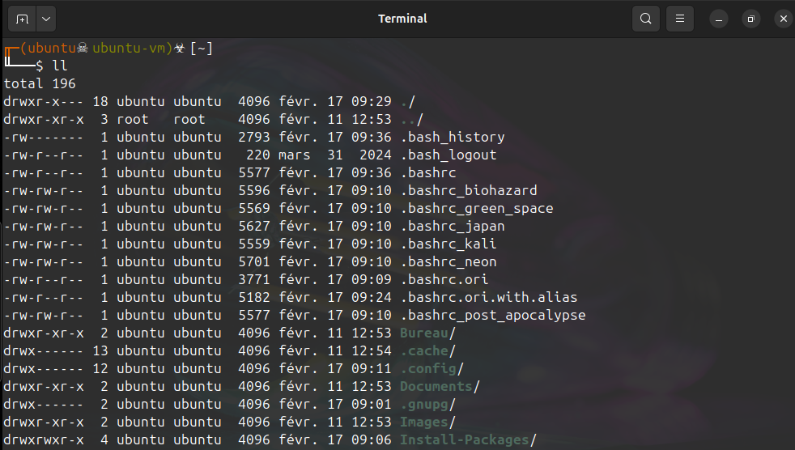
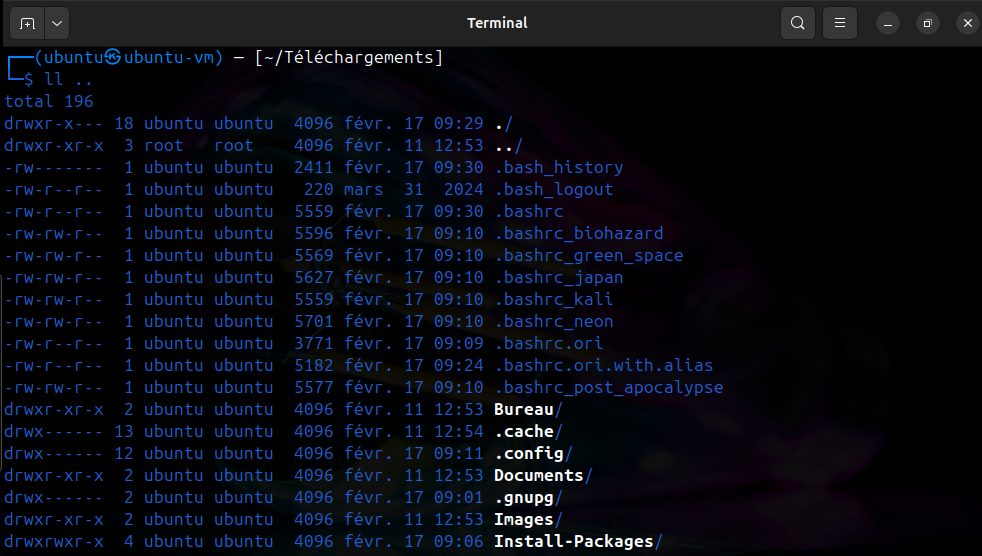
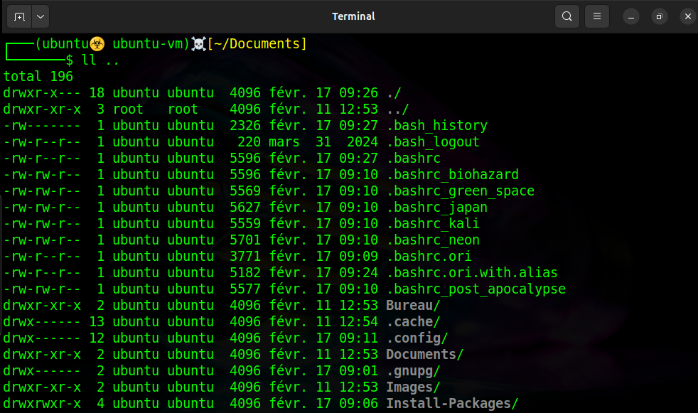
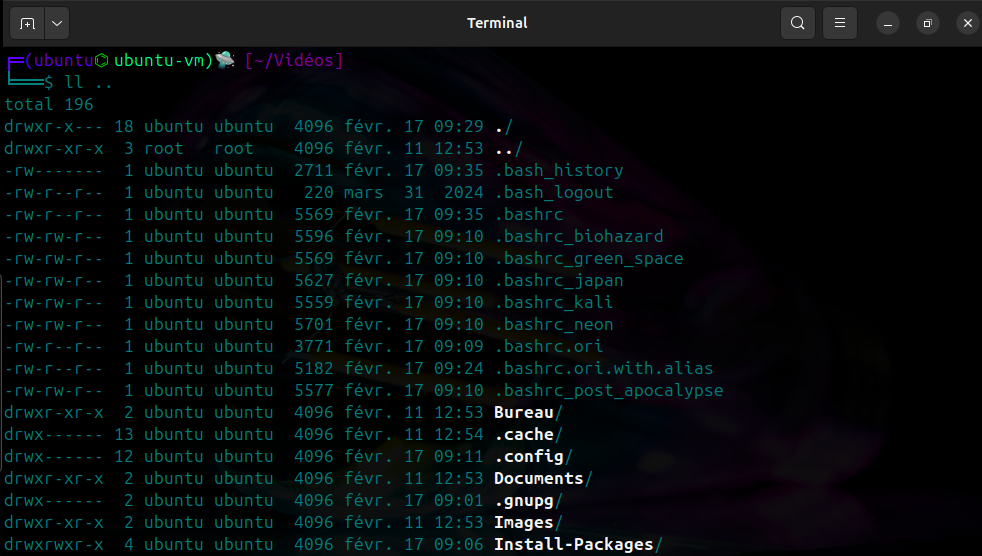

  

# README

**Veuillez lire tout le readme.md svp**  

# Disclaimer

Je ne serai responsable en aucun cas des problèmes rencontrés lors de l'installation des packages sur votre ordinateur, que ça soit pendant ou après l'installation. Je vous conseille de lire au complet le script "Script-Install-Packages-Linux.sh", d'une part pour comprendre exactement ce qu'il va faire sur votre ordinateur et d'autre part pour enlever ce que vous ne voulez pas (à vos risques ; soyez sûr de ce que vous faites)  

# Introduction

Install-packages est conçu pour pouvoir installer rapidement et facilement plusieurs packages et applications ; idéal sur un nouvel OS fraichement installé  

# Informations

- Certaines installations durant le script ont besoin d'une fermeture de session (elle est prévu en fin de script), veuillez effectuer la fermeture de session avant d'essayer un packages, applis ...
- Si vous décider d'installer rclone, les 2 fichiers présents dans "./Necessary/Obsidian-rclone" sont à modifier ; les chemins se nommant "Google-drive:/Obsidian-Google-Drive" et "/home/$USER/Obsidian_Vault/" vous sont personnels, ils dépendent des dossiers de votre pc et des dossiers de votre google-drive
- Un fichier log se nommant `Script-Install-Packages-Linux.sh.log` est créé dans `/var/log/`
- Si vous décidez de copier les `.bashrc`, un fichier .bashrc.ori est créé à côté du .bashrc, ils intègrent des petits changements sur le prompt (pour changer de `.bashrc` lancer la commande `cp -f <~/.bashrc_voulu> .bashrc` et relancer le prompt ou lancer un `source ~/.bashrc`) :  
1 - Un changement visuel pour chaque `.bashrc_*`   

| Neon (~/.bashrc_neon) | Japan (~/.bashrc_japan) |
| :----------------: | :----------------: |
|  | |

| Post Apacalypse (~/.bashrc_post_apocalypse) | Kali (~/.bashrc_kali) |
| :----------------: | :----------------: |
|  | |

| Biohazard (~/.bashrc_biohazard) | Green Space (~/.bashrc_green_space) |
| :----------------: | :----------------: |
|  | |

2 - Une modification du $PATH (Ils servent pour les alias)   
3 - Des alias :
>- dns  
>- ipls  
>- bat  
>- logoff  
>- getuser  
>- sherlock (valide **uniquement** si vous avez fait l'installation de sherlock)  
>- metasploit (valide **uniquement** si vous avez fait l'installation de metasploit)  
>- harvester (valide **uniquement** si vous avez fait l'installation de theHarvester)  
>- sqlmap (valide **uniquement** si vous avez fait l'installation de SQLmap)  
>- service  
>- allservice  
>- servicesystemd  
>- whatfilemanager  
>- whatenvironment  
>- ...  

- Si vous décidez d'installer de nouveaux thèmes il génère un changement visuel du prompt que vous pouvez régler via les préférences de votre prompt ; des curseurs et icônes qui sont accessibles via "Tweaks"

# Etape d'installation

- 1 - Copier le dossier "**Necessary**" et le fichier "**Script-Install-Packages-Linux.sh**" dans votre dossier personnel

- 1.1 - Donner les droits d'exécution pour l'owner sur le fichier **Script-Install-Packages-Linux.sh**

- 2 - Lancer le fichier "**Script-Install-Packages-Linux.sh**" et suivez les instructions

- 3 - Après l'installation, lire le memo.txt si besoin

  

# Version validé

Le script à été testé uniquement sur :  
[Ubuntu 22.04 LTS](https://releases.ubuntu.com/jammy/)  

# Problème connu
> [!NOTE]
> - Burpsuite n'est pas à jour -> Oui je sais, il est possible de devoir faire une update à la mano

